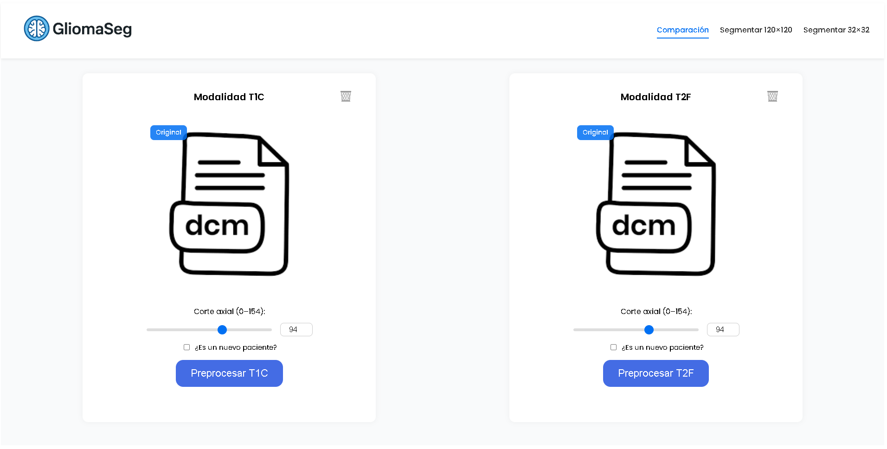
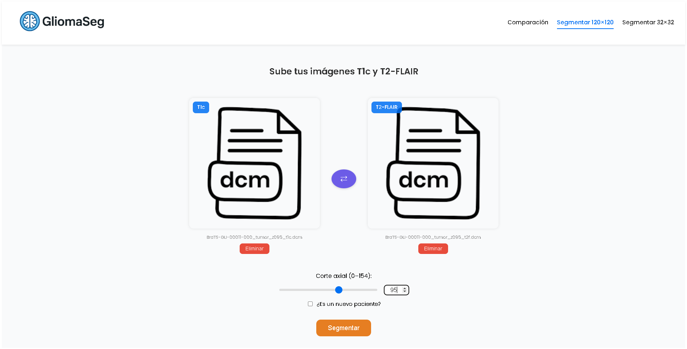
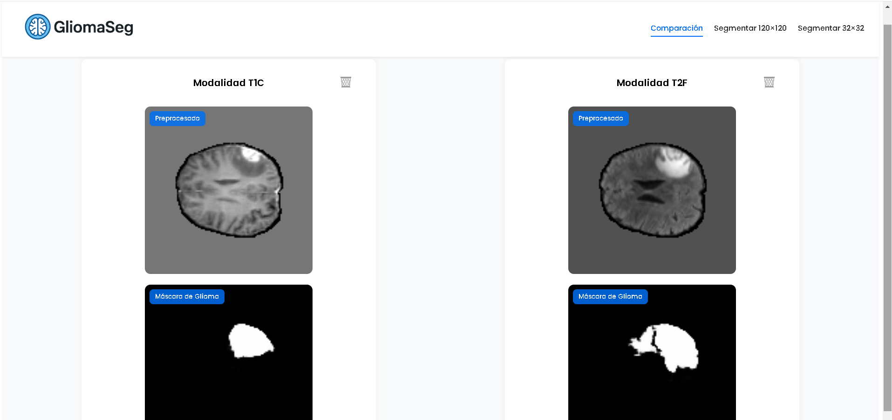
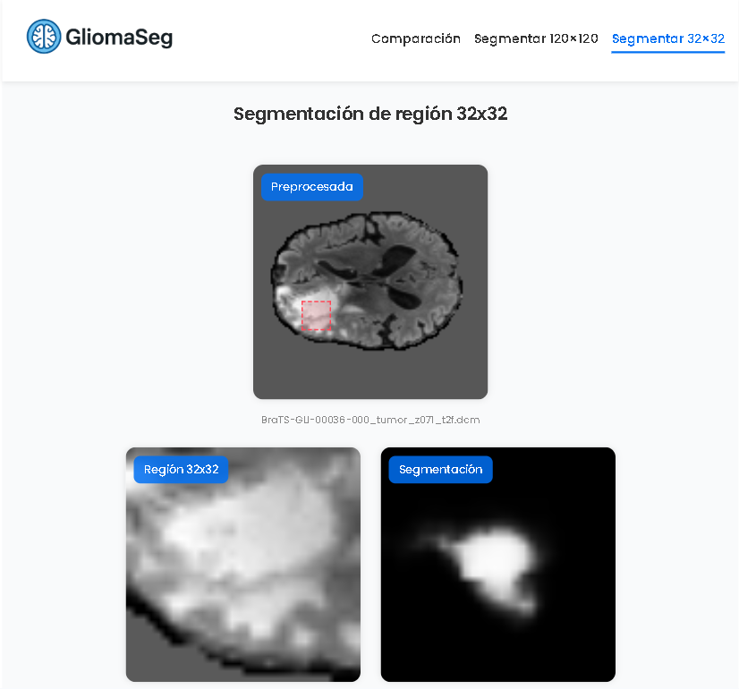
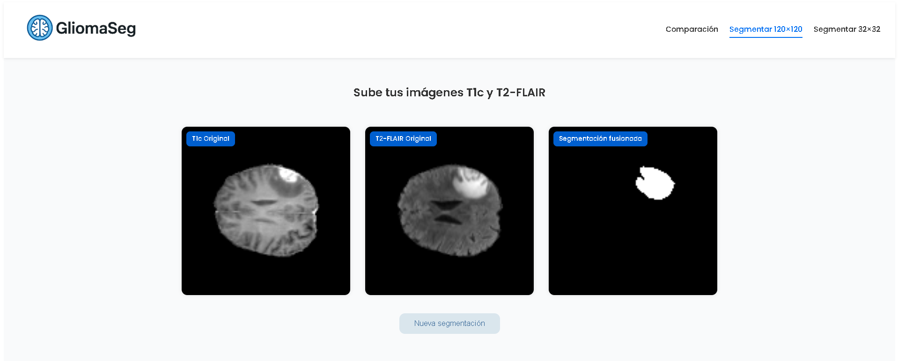

# Web Brain Segmentation (2D)

Interfaz web para **segmentación de gliomas en RM 2D** (modalidades **T1c** y **T2‑FLAIR**), compuesta por un **frontend en Angular 19** y un **backend en FastAPI + TensorFlow** con modelos pre‑entrenados (formato **SavedModel**).

> **Objetivo:** permitir cargar imágenes DICOM (o PNG/JPG ya preprocesadas), aplicar **máscara de cerebro** y obtener **segmentación de glioma** a nivel de **imagen completa 120×120** o en **regiones ROI 32×32**.

---

## Arquitectura & Stack

- **Frontend:** Angular 19 (standalone components), RxJS, `ldrs` (loader).
- **Backend:** FastAPI, Uvicorn, TensorFlow 2.15, NumPy, OpenCV, PIL, pydicom, SciPy.
- **Modelos incluidos (SavedModel):**
  - `brain120x120_t1c_saved`, `brain120x120_t2f_saved` → **cerebro/fondo** (preprocesamiento).
  - `model_t1c_saved`, `model_t2f_saved` → **glioma 120×120**.
  - `model_t1c_32x32_saved`, `model_t2f_32x32_saved` → **glioma 32×32**.

---

## Estructura del proyecto

```
backend-glioma-segmentation/
├─ main.py                         # FastAPI (endpoints)
├─ preprocesamiento.py             # Normalización y máscara de cerebro (modelos 120x120)
├─ segmentacion_glioma.py          # Segmentación de glioma 120x120 (T1c/T2-FLAIR)
├─ segmentacion_glioma_32.py       # Segmentación de glioma 32x32 (T1c/T2-FLAIR)
├─ utils.py                        # Utilidades (IDs normalizados)
├─ requirements.txt                # Dependencias (FastAPI, TensorFlow, etc.)
├─ brain120x120_t1c_saved/         # SavedModel: cerebro/fondo (T1c)
├─ brain120x120_t2f_saved/         # SavedModel: cerebro/fondo (T2-FLAIR)
├─ model_t1c_saved/                # SavedModel: glioma 120x120 (T1c)
├─ model_t2f_saved/                # SavedModel: glioma 120x120 (T2-FLAIR)
├─ model_t1c_32x32_saved/          # SavedModel: glioma 32x32 (T1c)
└─ model_t2f_32x32_saved/          # SavedModel: glioma 32x32 (T2-FLAIR)

frontend-glioma-segmentation/
├─ package.json                    # Angular 19
├─ src/app/
│  ├─ app.routes.ts                # Rutas (upload, brain-mask, segment-120, segment-32, results)
│  ├─ services/brain-segmentation.service.ts  # Llamadas HTTP al backend
│  └─ pages/
│     ├─ upload/                   # Subida y preprocesamiento de T1c/T2-FLAIR
│     ├─ brain-mask/               # (placeholder) vista de máscara de cerebro
│     ├─ segment-120/              # Flujo completo 120x120
│     ├─ segment-32/               # ROI 32x32
│     └─ results/                  # (placeholder) resultados
└─ ...
```

---

## Quickstart

### 1) Backend (FastAPI)

**Requisitos:** Python 3.10+ (recomendado), virtualenv opcional, GPU (opcional).

```bash
cd backend-glioma-segmentation
python -m venv .venv && source .venv/bin/activate  # en Windows: .venv\Scripts\activate
pip install -r requirements.txt
uvicorn main:app --reload --port 8000
```

> Los modelos SavedModel ya deben estar en las carpetas indicadas (ver estructura). El backend crea una carpeta `temp/` para archivos temporales.

### 2) Frontend (Angular)

**Requisitos:** Node 18/20, Angular CLI.

```bash
cd frontend-glioma-segmentation
npm install
npm start
```

---

## Flujo de uso (UI)

1. **Upload** (`/`): carga T1c y/o T2‑FLAIR (arrastrar/soltar o file picker). Vista previa + loader.  
2. **Preprocesamiento:** normalización + **máscara de cerebro** (modelos 120×120).  
3. **Segmentación 120×120:** por modalidad, con contexto adicional (`slice_index`, `patient_id`).  
4. **Segmentación 32×32 (ROI):** recorte centrado y predicción rápida por modalidad.  
5. **Fusión de modalidades:** endpoint que devuelve segmentación **fusionada** y originales normalizados (base64).

---

## API del backend

**Base URL:** `https://glioma-backend-682743754173.us-central1.run.app`

### `POST /procesar-dcm`
- **FormData:** `file` (DICOM), `modalidad` ∈ {{`t1c`,`t2f`}}  
- **Respuesta:** `image/png` (cerebro normalizado + máscara) — también guarda `temp/<filename>_processed.png`

### `POST /segmentar-glioma`
- **FormData:** `file` (mismo nombre usado en `/procesar-dcm`), `modalidad`, `slice_index` (int), `patient_id` (str)  
- **Respuesta:** `image/png` con **máscara 120×120** de la modalidad indicada.

### `POST /fusionar-glioma`
- **FormData:** `file_t1c` (PNG preprocesado) y `file_t2f` (PNG preprocesado), `slice_index`, `patient_id`  
- **Respuesta (JSON):**
  ```json
  {{
    "t1c_original": "<base64 png>",
    "t2f_original": "<base64 png>",
    "segmentacion_fusionada": "<base64 png>"
  }}
  ```

### `POST /recortar-region-32x32`
- **FormData:** `filename` (PNG preprocesado guardado en `temp`), `center_x`, `center_y`  
- **Respuesta:** `image/png` con el **recorte 32×32**.

### `POST /segmentar-32x32`
- **FormData:** `file` (PNG 32×32), `modalidad`, `slice_index`, `patient_id`  
- **Respuesta:** `image/png` con **máscara 32×32** de la modalidad indicada.

> El backend calcula `z_norm` a partir de `slice_index` (agrupando cada 4 cortes) y `id_norm` mediante un mapeo interno de IDs cargados desde `train.txt`, `val.txt`, `test.txt` (ver `utils.py`).

---

## Backend con Docker

Para facilitar el despliegue en local, se puede construir el contenedor directamente desde el `Dockerfile` incluido en el backend.

### Construir la imagen

```bash
cd backend-glioma-segmentation
docker build -t glioma-backend .
```

### Ejecutar el contenedor

```bash
docker run -d -p 8000:8000 glioma-backend
```

El backend estará disponible en:

```
http://localhost:8000/docs
```

---

## Capturas (placeholders)

- **Carga y preprocesamiento**  
  

- **Segmentación 120×120**  
  

- **Resultado de segmentación 120×120**  
  

- **Segmentación 32×32 (ROI)**  
  

- **Fusión T1c + T2‑FLAIR**  
  


---

## Notas y limitaciones

- Este proyecto procesa archivos en **local** y usa `temp/` para persistencia temporal. Ajusta limpieza y seguridad según tu despliegue.
- Los modelos están **pre‑entrenados fuera** de este repo; no incluyen datos de entrenamiento.
- Rendimiento y exactitud dependen de la calidad de entrada (modalidad correcta, normalización, ubicación del ROI).

---

## Agradecimientos

- Comunidad de **FastAPI** y **Angular**.  
- Autores de librerías científicas (**TensorFlow**, **NumPy**, **OpenCV**, **pydicom**, **PIL**).
